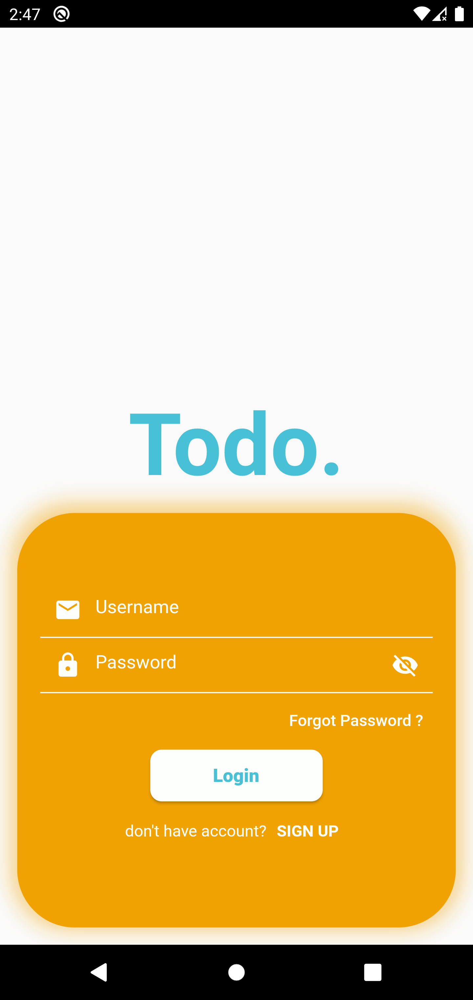
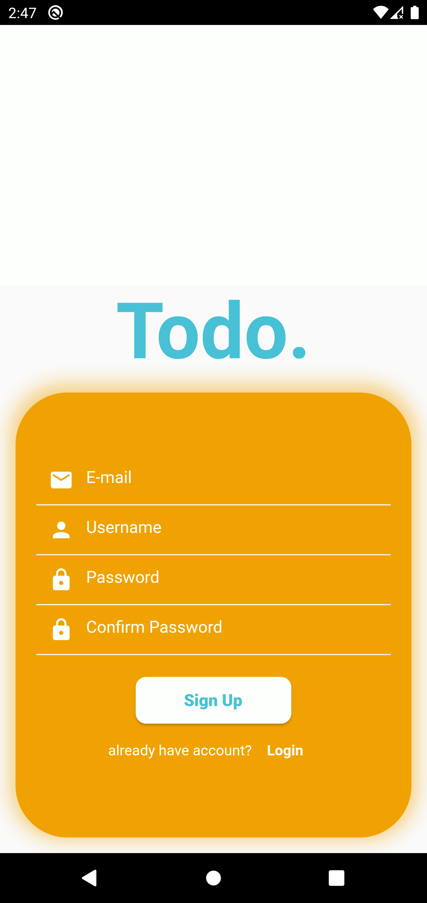
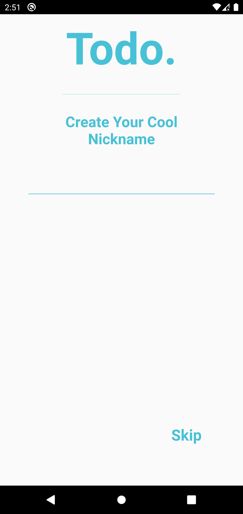
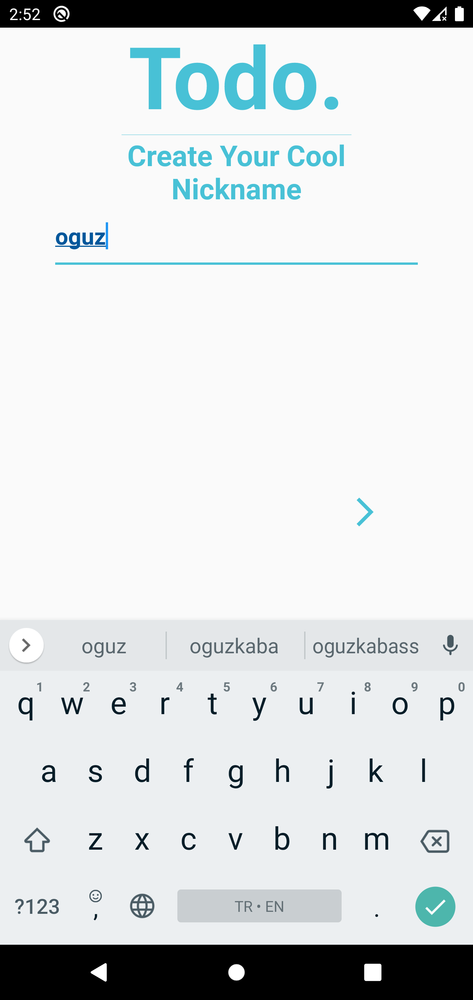
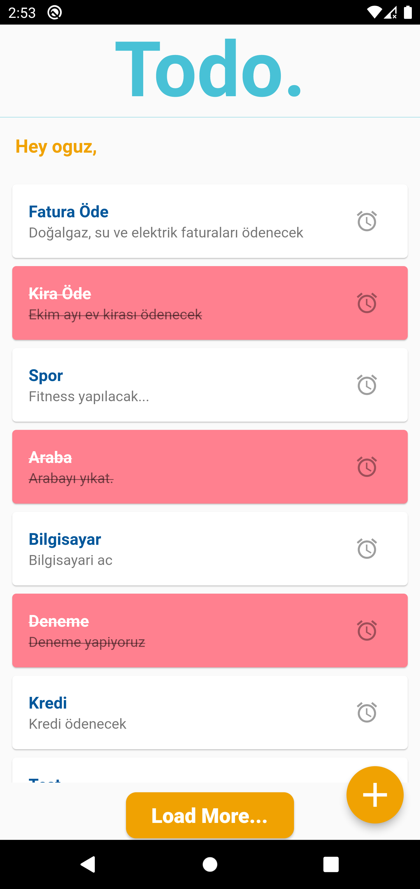
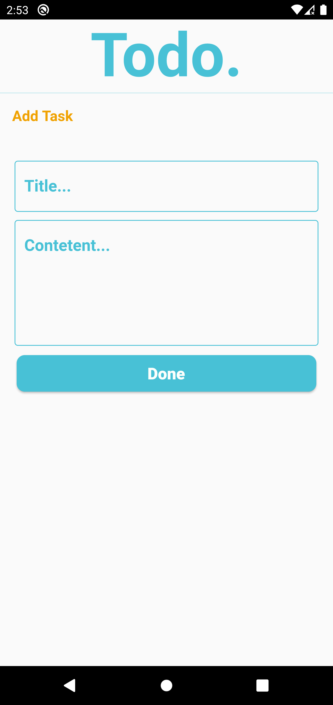

# TODO.
## ScreenShots

    
    

## Flutter Development

In summary, the packages used for TODO implementation,

* [GetX](https://pub.dev/packages/get) is an extra-light and powerful solution for Flutter. It combines high-performance state management, intelligent dependency injection, and route management quickly and practically.
* [http](https://pub.dev/packages/http) This package contains a set of high-level functions and classes that make it easy to consume HTTP resources. It's multi-platform, and supports mobile, desktop, and the browser. 
* Dart Null safety used
 
 
 ###  RestAPI / API Key
 
 * http package for restAPI connection (Node.js-MySQL)
